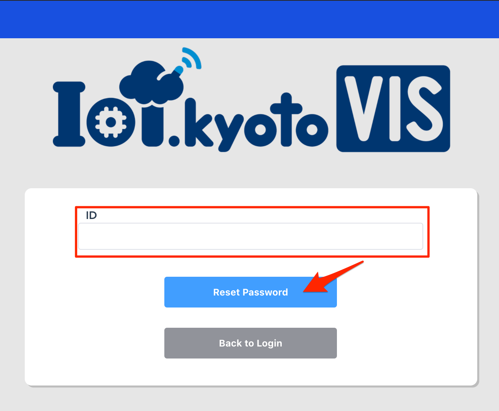

## Contents

### [[Step 0] Advance preparation](#step0)

### [[Step 1] Build a DynamoDB table](#step1)

### [[Step 2] Get IAM Access Key](#step2)

### [[Step 3] Login using your IoT.kyoto VIS account](#step3)

### [[Step 4] Visualize on graph screen](#step4)

### [[Option 1] Change graph settings](#option1)

### [[Option 2] Set the threshold](#option2)

### [[Option 3] Search past data](#option3)

### [[Option 4] Download csv](#option4)

### [[Option 5] Rearrange panels](#option5)

### [[Option 6] Delete graph](#option6)

## [Step 0] Advance preparation <a name="step0"></a>

### Things to prepare in advance

-   IoT device (outputs the measured value)
-   AWS account

### 1. IoT.kyoto VIS configuration example

The following is a configuration example when using IoT.kyoto VIS.

IoT.kyoto VIS assumes that your data is in Amazon DynamoDB.


### 2. Data required to use IoT.kyoto VIS.

(Ex) Data required for IoT devices that output temperature and illuminance.

-   **ID and time stamp identifying the IoT device is required.**
-   In the table below, temperature and light are the measured values output from the IoT device.
-   These data measured by the IoT device are created in DynamoDB table by [[Step 1] DynamoDB construction](#step1), and the data is written to the table. In addition, you can make a graph in real time by setting in [[Step 4] Visualize on graph screen](#step4).

    | deviceID | time                 | temperature | light |
    | -------- | -------------------- | ----------- | ----- |
    | 01       | 2016-03-04T10:17:44Z | 25.6        | 103   |
    | 02       | 2016-03-04T10:17:44Z | 22.1        | 216   |
    | 01       | 2016-03-04T10:17:45Z | 25.8        | 98    |
    | 02       | 2016-03-04T10:17:45Z | 21.9        | 210   |

-   Use one of the following time stamps. When the screen is displayed, UTC is automatically converted to the set time zone.

```txt
[UTC]
  YYYY-MM-DDThh:mm:ssZ
  UNIX timestamp(Integer 10 digits)
  UNIX timestamp(Integer 13 digits)
[Other]
  YYYY-MM-DD hh:mm:ss
  YYYY-MM-DD hh:mm:ss.sss
  YYYY-MM-DDThh:mm:ss+hhmm
  YYYY-MM-DDThh:mm:ss+hh:mm
  YYYY-MM-DDThh:mm:ss.sss+hhmm
  YYYY-MM-DDThh:mm:ss.sss+hh:mm
  YYYY/MM/DD hh:mm:ss
  YYYY/MM/DD hh:mm:ss.sss
  YYYY/MM/DDThh:mm:ss+hhmm
  YYYY/MM/DDThh:mm:ss+hh:mm
  YYYY/MM/DDThh:mm:ss.sss+hhmm
  YYYY/MM/DDThh:mm:ss.sss+hh:mm
```

### 3. How to write data to DynamoDB

-   Export device ID / time stamp / measurement value in **JSON format** as below.
-   In case of csv etc., it is necessary to convert to JSON format.

```json
{"light": 164, "ID": "id000", "time_sensor": "2016-03-28 15:16:48"}
{"light": 692, "ID": "id000", "time_sensor": "2016-03-28 15:16:49"}
```

-   Write data to DynamoDB by the following method. (Please also refer to [Implementation example](https://iot.kyoto/integration_case/))
    -   Use API.
    -   Use SDK for various languages.
    -   Use [AWS CLI](https://aws.amazon.com/jp/cli/).
    -   Write via AWS services such as AWS IoT and Lambda.
    -   Use middleware such as fluentd.
    -   Use an ETL tool such as DataSpider (OK even if it is not JSON).
-   Please refer to [AWS developer resources](https://aws.amazon.com/jp/dynamodb/developer-resources/) for API / SDK.

## [Step 1]Build a DynamoDB table<a name="step1"></a>

### 1. Sign in to the AWS Management Console

-   Log in to the[AWS Management Console](https://console.aws.amazon.com/).
-   Enter "dynamo" in the "Find Services" field of the Negotiation Console and select "DynamoDB".


### 2. Check the region

-   If you have no reason to choose another region, select the closest region.


### 3. Select [Create table] in the DynamoDB console screen


### 4. Enter any name in the table name


### 5. Enter any name for the partition key of the primary key

-   It is a key that contains a value that identifies the IoT device.
-   Enter a name that matches the key name sent by your IoT device.
-   Select "Character string" or "Numeric value" as the data type according to the value output by the IoT device.
    

### 6. Check the [Add sort key] checkbox


### 7. Enter any name for the sort key of the primary key

-   Enter time such as data transmission time.
-   Please enter a name along with the key name of the transmission time sent by the IoT device.
-   Select "Character string" or "Numeric value" as the data type according to the value output by the IoT device.


## [Step 2]Get IAM Access Key<a name="step2"></a>

Grant the access key created here to obtain records and table information of all DynamoDB tables. If you want to narrow down the table, please refer to the procedure of [here](#create_custom_key).

### 1. Open the Identity and Access Management (IAM) console

-   Enter "IAM" in the "Find Services" field of the management console and select "IAM".


### 2. Select and open [Users], click [Add User], and create a user with any name


-   Check the box for [Programmatic access].
-   Select [Next Step].


### 3. Set access authority

-   Select[Attach an existing policy directly].
-   Check the [AmazonDynamoDBReadOnlyAccess] policy and select [Next Step].


### 4. Enter [Add Tag] as desired and select [Next Step].

### 5. Check the contents and if there is no problem, select the [Create User] button to create an account

-   After creating the account, download the csv file with the authentication information.

    <span style="color: red;">※If you forget to download here, you will need to issue the authentication information again, so be sure to download it.</span>


## ※How to create Access Key with limited privileges.<a name="create_custom_key"></a>

If the access key has been issued, proceed to [Step 3](#step3)

### 1. Open the Identity and Access Management (IAM) console

-   Enter "IAM" in the "Find Services" field of the management console and select "IAM".


### 2. Select "Policies" to open it, then select "Create Policy"


### 3. Create a policy that grants read-only permissions for the specific DynamoDB table

-   Select DynamoDB from [Select Service].
    
-   Enter `getItem` in [Filter action] and check the checkbox of`GetItem`.
    
-   Enter `query` in [Filter action] and check the checkbox of`Query`.
    
-   Enter `describeTable` in [Filter action] and check the check box of`DescribeTable`.
    
-   Select Resources and select the Add ARN button.
    
-   Fill in the required information and select the [Add] button.
    
-   Confirm your entry and select [Confirm Policy].
    
-   Enter any policy name and select [Create Policy].
    

### 4. Select [Users], open it and select [Add User] to create a user with any name


-   Check the box for [Programmatic access].
-   Click [Next Step].


### 5. Set access authority

-   Select [Attach existing policy directly].
-   Check the check box of the policy created in 3 and select [Next Step].
-   Attaching the policy above will allow you to retrieve data from a specific DynamoDB.


### 6. Enter [Add Tag] as desired and select [Next Step]

### 7. Check the contents and if there is no problem, select the [Create User] button to create an account

-   After creating the account, download the csv file with the authentication information.

    <span style="color: red;">※If you forget to download here, you will need to issue the authentication information again, so be sure to download it.</span>


## [Step 3] Login using your IoT.kyoto VIS account<a name="step3"></a>

<span style="color: red;">
※Please note that IoT.kyoto VIS does not support Internet Explorer.

<span style="color: red;">
Please use modern browsers such as Google chrome and firefox.

### 0. Access [IoT.kyoto VIS](https://vis2.iot.kyoto){:target="\_blank"}]


1. Sign in：Please sign in here after completing new registration.
   (You can also use the login information registered on the old VIS site here.)

2. Create Account：If you do not have an account, please create one from here.
3. Forgot your password?：If you forget your account password, please reissue your password here.

### 1. Create an account

#### 1.1. Select the [Create Account] button to display the new registration screen


#### 1.2. Enter your email address, ID and password

If the ID is the same as the email address and there is no problem, check the "I prefer to use my email address as my ID" checkbox.

After confirming the Terms of Service and checking the agreement, click the "Register" button and a confirmation email will be sent to the email address you set.

<span style="color: red;">※When setting the password, set it to 8 characters or more, including uppercase letters, lowercase letters, and numbers. An error will occur if this condition is not met.</span>

#### 1.3. Wait for the verification email to arrive at the email address you set

Click the link in the email to complete registration.

### 2. If you forget your password

#### 2.1. Select [Forgot your password?]

#### 2.2. Enter your ID and select the [Reset Password] button



The verification code will be sent to the registered email address.

<span style="color: red;">※Please note that if you forget your ID, you cannot reset the password.</span>

#### 2.3 Reset the password using the verification code in the email

Enter the submitted verification code in the form and set a new password.

Select the [Reset Password] button to complete the password reset.


## [Step 4] Visualize on graph screen<a name="step4"></a>


1. General Settings：You can set the time zone and language
2. IoT.kyoto：Move to [IoT.kyoto](https://iot.kyoto){:target="\_blank"}
3. How to Use：Move to this page
4. Log out：Log out
5. Add Graph：Add a graph
6. Rearrange panels：If there are multiple graphs, sort the graphs.
7. Change graph size：You can arrange the graphs in two columns or one column.

### 1. Add a graph

#### 1.1. Select [Add Graph] icon

-   Select the [Add Graph] icon.


### 2. Set the credential.

-   Enter the access key and secret key created in [[Step 2] Get IAM Access Key](#step2).
-   Enter any name for the credential store name.

    <span style="color: red;">※Please note that if you specify a name that is already registered, it will be overwritten.</span>

-   For Region, select the region where the DynamoDB table is created and select [Next].


-   If you want to use the already registered credentials, select [Existing credentials].
-   Select the credentials you want to use and select [Next].


### 3. Enter the table name.

-   Enter the table name to visualize the graph.
-   Select [Check connection].
-   If there is no mistake in the partition key and sort key information, select [Next].

<span style="color: red;">※If "Please check the table name" is displayed at this time, the entered table does not exist. Make sure the table name is entered correctly.</span>

<span style="color: red;">※At this time, if "Please check the credential set in Step1." is displayed, it is possible that the authentication information has not been entered correctly or that the required authentication information has not been granted. Please check each. Please confirm [[Step 2] Get IAM Access Key](#step2).</span>

|||

### 4. Set the date format of sensor data

-   Select [Unix] or [Others].
-   For [Unix], select either 13 digits that include milliseconds or 10 digits that do not include milliseconds and select [Next].
-   For [Others], select each according to the format of the date and time sent from the sensor and select [Done].
-   If the time zone is not specified within the date and time, set (b) to "(empty)" and select the time zone of the sensor data date and time in [Local time zone].
-   Check that the format is correct and select [Next].


### 5. Check the settings and save

-   Confirm that the settings are correct and select [Save]


### 6. Select the sensor you want to display

-   After returning to the graph screen, select the sensor you want to display from the image selector.


#### When there is no sensor to display

-   Select [Add] in the selector.
-   Enter the partition key value you want to display in the displayed form and select [Add].
-   Select [Cancel] to return to the selector and select the key you just added.


### 7. Select the display target key you want to display and draw a graph

-   Select the update key button
-   The graph is drawn by selecting the item of the graph you want to display from the options displayed next to the display target key

※Drawing is not possible if the latest data does not exist


## [Option 1] Change graph settings<a name="option1"></a>

Here we will show you how to set the graph title and update frequency.

### 1. Open the graph setting screen

-   Select the [gear icon] on the graph screen whose settings you want to change.


-   Select [Manual Setting] from the setting screen


-   Select [Graph Display] tab


### 2. Make various settings


1. You can change the title displayed at the top of the graph.
2. You can set the interval to update the graph data.

    The minimum value is 1 second, but decreasing the value will narrow the graph drawing width.

3. You can specify the length of the data drawn in the graph.

    Get the specified amount of data from the current time.

4. You can set the date and time format to be displayed on the horizontal axis of the graph.
5. You can set the range of the vertical axis.

    If "off", it is set automatically.

6. You can set how to connect the graph data.
7. Selectable partition key can be deleted/added.
8. Selectable display target keys can be deleted/added.

## [Option 2] Set the threshold<a name="option2"></a>

### 1. Open the threshold setting screen

-   Select the [gear icon] on the graph screen for which you want to set the threshold


-   Open the [Thresholds] tab from the setting screen


### 2. Set the threshold for the item you want to set

-   Select the item for which you want to set the threshold from the display target keys.
-   Switch the switch for the item (upper / lower) you want to set and set the value.
-   If you want to send an alert email, enter the email address in [Alert Email Address(es)]
    If you specify more than one, separate them with commas (up to 5 can be registered)
-   After entering the setting items, select the [Save] button.


### You can check the error history

-   Notification will be sent to the anomaly history when the value exceeds or falls below the set threshold.


-   If you select the [Alarm history] button, you can check the history that exceeded or fell below the set threshold (up to 100).


### You can receive email notifications by setting email

-   If you specify the alert mail destination in the threshold setting, you can receive an email notification when the threshold is exceeded / below

    ※in Japanese. Sorry! English version coming soon

    <span style="color: red;">※You can receive emails only while the IoT.kyoto VIS screen is open</span>


## [Option 3] Search past data<a name="option3"></a>

### 1. Open the past data search screen

-   Select [the magnifying glass] icon on the graph screen for which you want to search past data


### 2. Fill in the search items

-   Select the device you want to search and the key to display
-   Specify the date and time you want to search
    -   When specifying the date and time, you can select the specified date and time "before", "after" and "specified period"
-   If you want to set the vertical axis range of the search result graph, set the range setting to "on" and set the numerical value.


### 3. Get the graph

-   You can get the data and display the graph by selecting the [Search] button.


<span style="color: red;">※Data acquisition may fail depending on the read capacity of the referenced DynamoDB table</span>

<span style="color: red;"> In that case, please narrow the search target period or adjust the read capacity of the DynamoDB table.</span>

## [Option 4] Download csv<a name="option4"></a>

### 1. Open csv download screen

-   Select [Download icon] on the graph screen where you want to download csv


### 2. Specify the device you want to download and the target period

-   Select the device you want to download from the selector
-   Set the download target period
    -   In the setting of the target period, it is possible to select the specified date and time "before" "after" and "specified period"


### 3. get csv file

-   You can get the csv file of the data of the specified condition by selecting the [Download] button


<span style="color: red;">※Cannot be downloaded if the data to be acquired exceeds 100,000 or 5MB</span>

<span style="color: red;">In that case, please adjust the target period</span>

<span style="color: red;">※Depending on the read capacity of the target DynamoDB table, the data acquisition may fail even if the target data is 100,000, even if it fits in 5MB.</span>

<span style="color: red;">In that case, please adjust the target period or read capacity of DynamoDB table.</span>

## [Option 5] Rearrange panels<a name="option5"></a>

This feature is only available when you have multiple graph screens

### 1. Switch to panels sort mode

-   Select the [Rearrange Panels] button at the top right of the screen


### 2. We will sort the graph.

-   You can move the corresponding graph screen by dragging it with the area displayed as [Drag here to rearrange panels] on the graph screen.


### 3. Exit sort mode

-   When the graphs are sorted, select the [End Rearrange Mode] button on each graph screen, or the [Rearrange Panels] button selected in 1.


## [Option 6] Delete graph<a name="option6"></a>

### 1. Select the [Delete This Graph] button

-   Select the [trash can icon] on the graph screen of the target you want to delete


### 2. Delete the graph from the alert screen

-   Select button 1 to display the confirmation screen for deleting the graph.
    If there is no problem in deleting, select the [OK] button.


<span style="color: red;">※Please note that the settings of the graph will be deleted after selecting the [OK] button.</span>
