# IoT.kyoto VIS の使い方

## 目次

### [[ステップ 0] 事前準備](#step0)

### [[ステップ 1] DynamoDB 構築手順](#step1)

### [[ステップ 2] IAM Access Key を取得する](#step2)

### [[ステップ 3] IoT.kyoto VIS のアカウントを使ってログインする](#step3)

### [[ステップ 4] グラフ画面について](#step4)

### [[付録 1] グラフ設定を変更する](#option1)

### [[付録 2] 過去データを検索する](#option2)

### [[付録 3] アラートの設定をする](option3)

## [ステップ 0] 事前準備 <a name="step0"></a>

### 事前に準備するもの

-   IoT デバイス(計測する値を出力します)
-   AWS アカウント

### [0-1] IoT.kyoto VIS 　構成例


### [0-2] IoT.kyoto VIS を使用するために必要なデータ

(例)温度と照度を出力する IoT デバイスの場合に必要なデータ

-   **IoT デバイスを識別する ID とタイムスタンプは必須です**
-   下表の場合、temperature と light は IoT デバイスから出力される計測対象の値です
-   IoT デバイスで計測したこれらのデータは「[[ステップ 1] DynamoDB 構築](#step1)」で DynamoDB のテーブルを作成後、
    テーブルにデータを書き込みます。さらに「[[ステップ 4] グラフ画面について](##[ステップ 4]-グラフ画面について)」で設定することで、
    リアルタイムでグラフ化することができます。

| deviceID | time                | temperature | light |
| -------- | ------------------- | ----------- | ----- |
| 01       | 2016-03-04 10:17:44 | 25.6        | 103   |
| 02       | 2016-03-04 10:17:44 | 22.1        | 216   |
| 01       | 2016-03-04 10:17:45 | 25.8        | 98    |
| 02       | 2016-03-04 10:17:45 | 21.9        | 210   |

タイムスタンプは書き 6 種類の内いずれかをお使いください。画面表示辞に UTC は JST に自動変換されます。

```txt
[JST]
　YYYY-MM-DD hh:mm:ss
　YYYY/MM/DD hh:mm:ss
　YYYY-MM-DDThh:mm:ss.sss+0900
[UTC]
　YYYY-MM-DDThh:mm:ssZ
　UNIXタイムスタンプ(整数10桁)
　UNIXタイムスタンプ(整数13桁)
```

### [0-3] DynamoDB にデータを書き込む方法

-   デバイス ID／タイムスタンプ／計測値を下記のように JSON 形式で書き出します。csv は利用できません。

```json
{"light": 164, "ID": "id000", "time_sensor": "2016-03-28 15:16:48"}
{"light": 692, "ID": "id000", "time_sensor": "2016-03-28 15:16:49"}
```

-   下記のような方法で JSON を DynamoDB に書き込みます。[実装例](https://iot.kyoto/integration_case/)も参照して下さい。
    -   API を利用する
    -   各種言語向けの SDK を利用する
    -   [AWS CLI](https://aws.amazon.com/jp/cli/)を利用する
    -   AWS IoT や Lambda などの AWS のサービスを経由して書き込む
    -   fluentd などのミドルウェアを利用する
    -   DataSpider などの ETL ツールを利用する(JSON でなくても OK)
-   API/SDK ついては[AWS の開発者用リソース](https://aws.amazon.com/jp/dynamodb/developer-resources/)を参照して下さい

## [ステップ 1]DynamoDB 構築手順<a name="step1"></a>

### 1. AWS マネジメントコンソールにサインインします

-   [AWS マネジメントコンソール](https://console.aws.amazon.com/)にログインします
-   マネジメントコンソールの「サービスの検索」欄に、「dynamo」と入力し、「DynamoDB」をクリックする


### 2. リージョンを確認します

-   得に他のリージョンを選ぶ理由がない場合は[アジアパシフィック(東京)]を選択してください。


### 3. DynamoDB のコンソール画面で[デーブルの作成]を選択します


### 4. テーブル名に任意の名前をつけます


### 5. プライマリキーのパーティションキーに任意の名前をつけます

-   データ型は IoT デバイスが出力する値に合わせて「文字列」または「数値」を選んでください
-   IoT デバイスの特定に分かりやすい名前を付けてください


### 6. [ソートキーの追加]のチェックボックスを選択してチェックを入れます


### 7. プライマリキーのソートキーに任意の名前をつけてください

-   時間の特定に分かりやすい名前を付けてください
-   データ型は IoT デバイスが出力する値に合わせて「文字列」または「数値」を選んでください


### 8. テーブル設定の[デフォルト設定の使用]のチェックボックスを選択してチェックを外します

<!-- メモ：この設定いらんくない？デフォルト5だし... -->


### 9. プロビジョニングされたキャパシティの[読み込み容量ユニット]と[書き込み容量ユニット]のチェックを外してユニット数を設定してください

<!-- メモ：この設定いらんくない？オートスケールさせない理由とは...？ -->
<!-- メモ：送信頻度にもよるし一概には言えないのでやっぱりこの設定(以下略) -->

-   IoT デバイス 2 ～ 3 個までなら「読み込み容量ユニット」が 5、「書き込み容量ユニット」が 5 で足ります
    -   [作成]をクリックしてテーブル作成は完了です

## [ステップ 2]IAM Access Key を取得する<a name="step2"></a>

ここで作成するアクセスキーにはすべての DynamoDB テーブルのレコードとテーブル情報を取得することができる権限を付与します。テーブルを絞りたい場合は[こちら](#create_custom_key)の手順を参考にしてください。

### 1. Identity and Access Management(IAM)コンソールを開いてください

-   マネジメントコンソールの「サービスの検索」欄に、「IAM」と入力し「IAM」を選択します

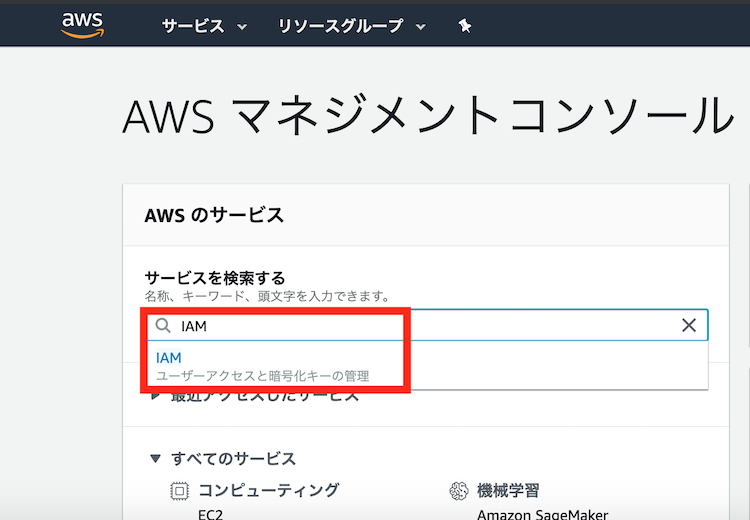

### 2. [ユーザー]を選択して開き、[ユーザーを追加]をクリックし、任意の名前でユーザーを作成します

-   [プログラムによるアクセス]のチェックボックスにチェックを入れます
-   [次のステップ]を選択します

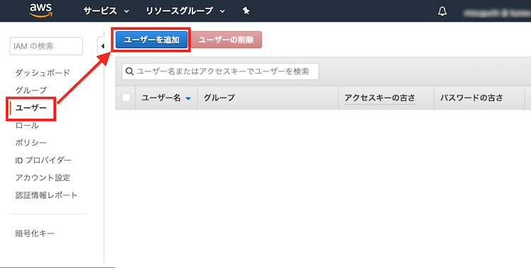

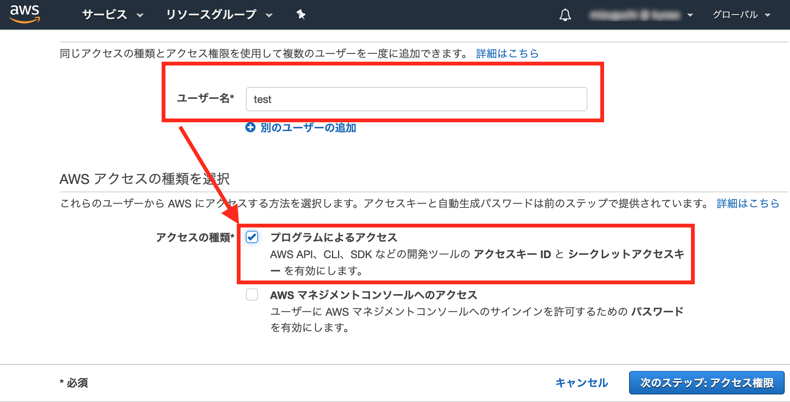

### 3. アクセス権限の設定を行います

-   [既存のポリシーを直接アタッチ]を選択します
-   [AmazonDynamoDBReadOnlyAccess]ポリシーにチェックをいれて[次のステップ]を選択します

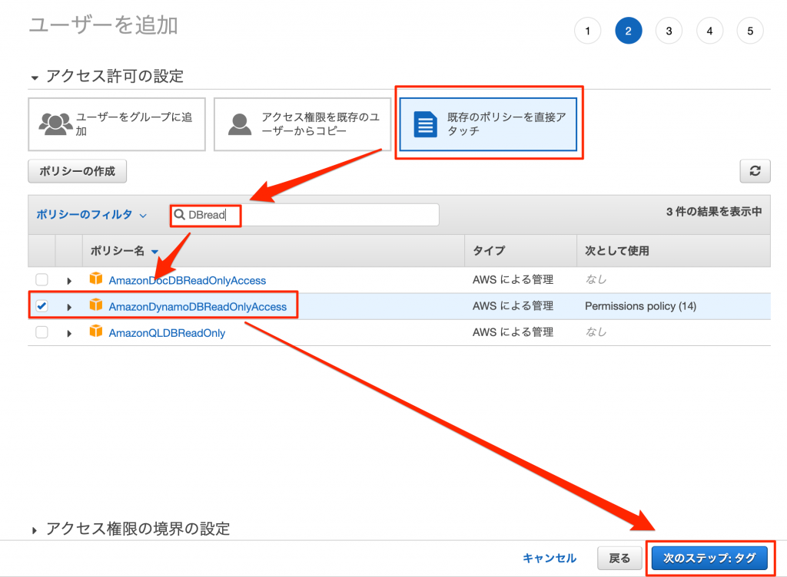

### 4. [タグの追加]は任意で入力し、[次のステップ]を選択します

### 5. 内容を確認し問題がなければ[ユーザーの作成]ボタンを選択してアカウントを作成します

-   アカウント作成後、認証情報が記載された csv ファイルをダウンロードします

    <span style="color: red;">※ここでダウンロードを忘れると再度認証情報の発行が必要になるので必ずダウンロードしてください！</span>

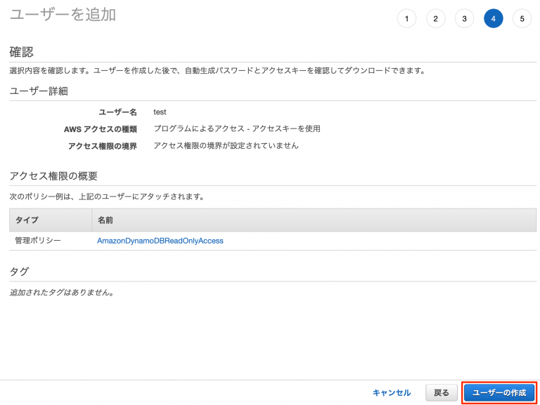

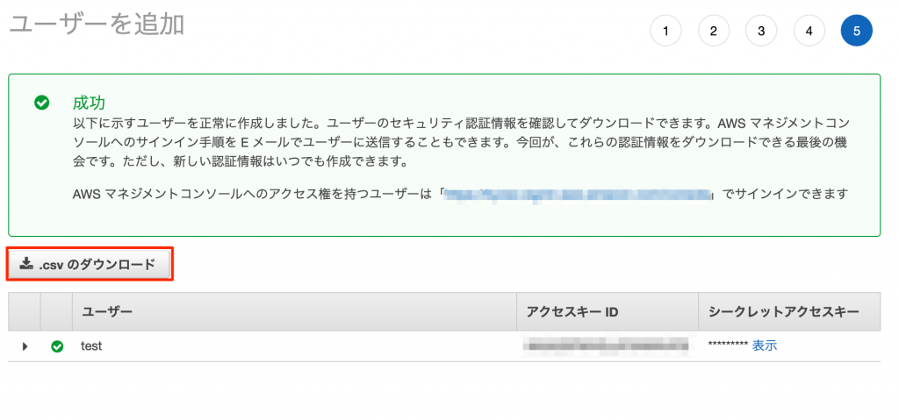

## ※テーブルを絞った権限を付与した Access Key の作成方法<a name="create_custom_key"></a>

Access Key の発行が完了している場合は[ステップ 3](#step3)に進んでください

### 1. Identity and Access Management(IAM)コンソールを開いてください

-   マネジメントコンソールの「サービスの検索」欄に、「IAM」と入力し「IAM」を選択します


## [ステップ 3] IoT.kyoto VIS のアカウントを使ってログインする<a name="step3"></a>

### 0. [IoT.kyoto VIS](https://vis2.iot.kyoto){:target="\_blank"}を開きます

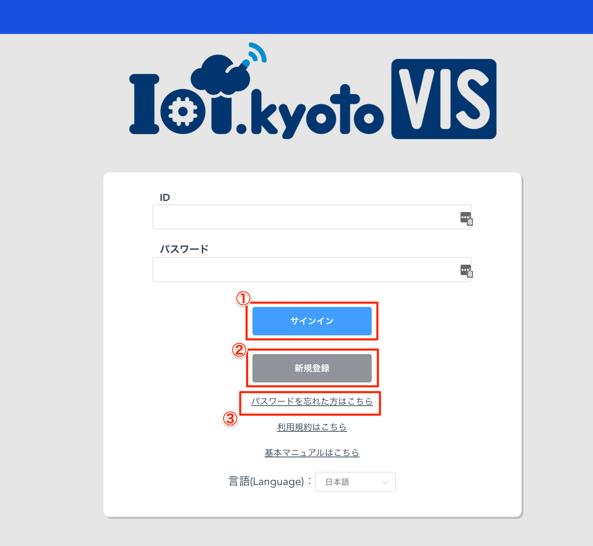

1. サインイン：新規登録を終えたあとはここからサインインしてください
   (旧 VIS サイトで登録されたログイン情報もこちらで利用することができます)

2. 新規登録：アカウントを保有していない場合はこちらからアカウント作成をしてください
3. パスワードを忘れた方はこちら：アカウントのパスワードを忘れた場合はこちらからパスワードの再発行を実施してください

### 1. まずは新規登録から始めましょう！

#### 1.1. 「新規登録」ボタンを選択すると新規登録画面が表示されます

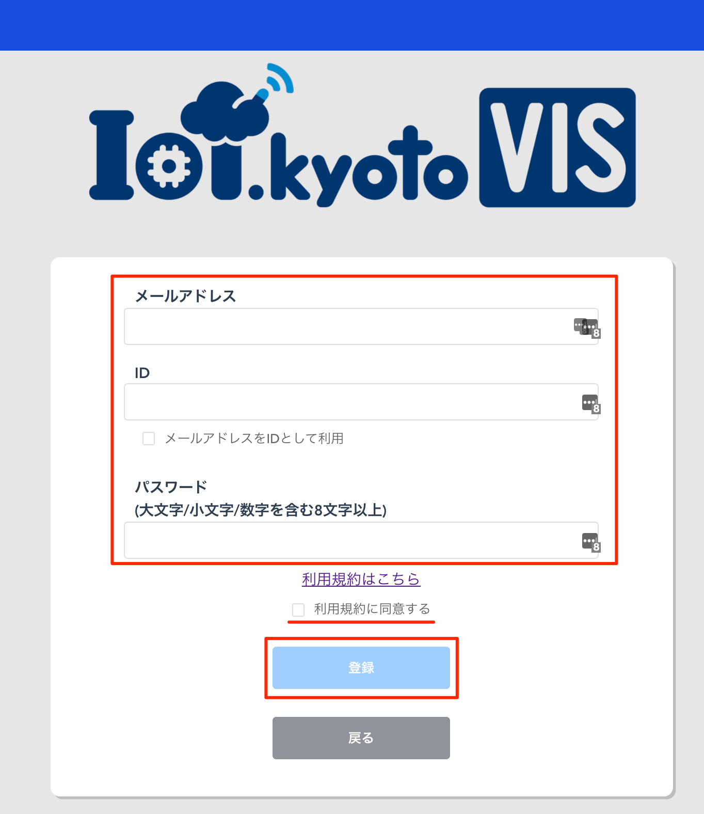

#### 1.2. メールアドレスと ID、パスワードをそれぞれ入力します

ID がメールアドレスと同様で問題なければ「メールアドレスと同じものを ID として利用する」のチェックボックスにチェックを入れます

<span style="color: red;">※パスワードを設定する際は大文字、小文字、数字をそれぞれ含め 8 文字以上に設定してください。この条件を満たさない場合はエラーになります。</span>

#### 1.3. 設定したメールアドレスに認証メールが届くのを待ちます

メール内のリンクをクリックすると登録完了です

### 2. パスワードを忘れてしまった場合

#### 2.1. 「パスワードを忘れた方はこちら」を選択します

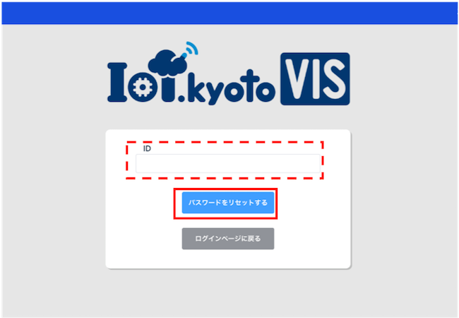

#### 2.2. ID を入力して「パスワードをリセットする」ボタンを選択します

登録したメールアドレスに認証コードが送信されます

<span style="color: red;">※ID を忘れた場合はパスワードの再設定はできませんのでご注意ください</span>

#### 2.3 メールに記載された認証コードを使ってパスワードのリセットをします

送信された認証コードをフォームに入力し、新しいパスワードを設定します

「パスワードを設定する」ボタンを選択するとパスワードの再設定完了です

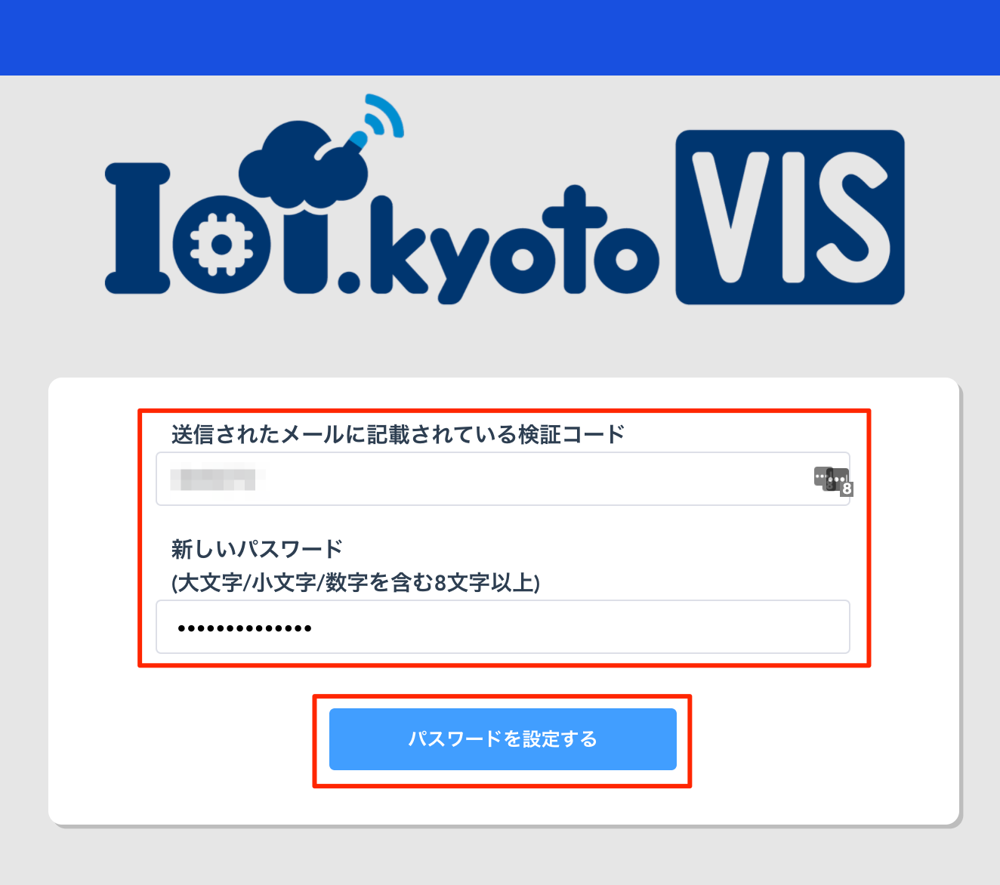

## [ステップ 4] グラフ画面で可視化する<a name="step4"></a>

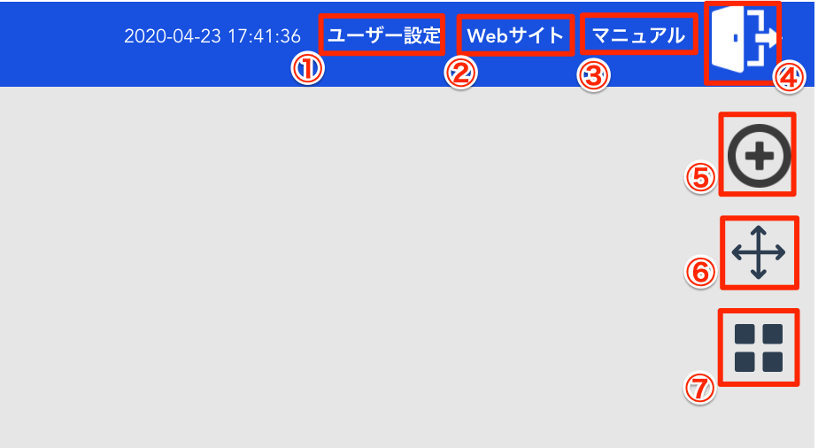

1. ユーザー設定：タイムゾーンや言語の設定ができます
2. web サイト：[IoT.kyoto](https://iot.kyoto){:target="\_blank"}のページに遷移します
3. マニュアル：本ページに遷移します
4. ログアウト：ログアウトします
5. グラフ追加：グラフを追加します
6. グラフ並べ替え：グラフが複数ある場合、グラフの並び替えをします
7. グラフ表示方法切り替え：2 列にグラフを並べたり、1 列にグラフを並べたりできます

### 1. グラフを追加します

#### 1.1. 「グラフ追加」アイコンを選択します

#### ここから先は新しい設定フローに則って新しくマニュアルを作成します

## [付録 1] グラフ設定を変更する<a name="option1"></a>

## [付録 2] 過去データを検索する<a name="option2"></a>

## [付録 3] アラートの設定をする<a name="option3"></a>
