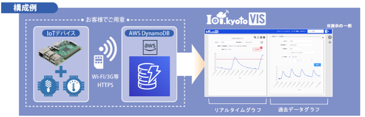

# IoT.kyoto VISの使い方

## [ステップ0] 事前準備

### 事前に準備するもの

- IoTデバイス(計測する値を出力します)
- AWSアカウント

### [0-1] IoT.kyoto VIS　構成例

### [0-2] IoT.kyoto VISを使用するために必要なデータ

**例えば、温度と照度を出力するIoTデバイスの場合に必要なデータ**

- **IoTデバイスを識別するIDとタイムスタンプは必須です**
- 下表の場合、temperatureとlightはIoTデバイスから出力される計測対象の値です
- IoTデバイスで計測したこれらのデータは「[1]DynamoDB構築手順」でDynamoDBのテーブルを作成後、テーブルにデータを書き込みます。さらに「[4]グラフ画面について」で設定することで、リアルタイムでグラフ化することができます。