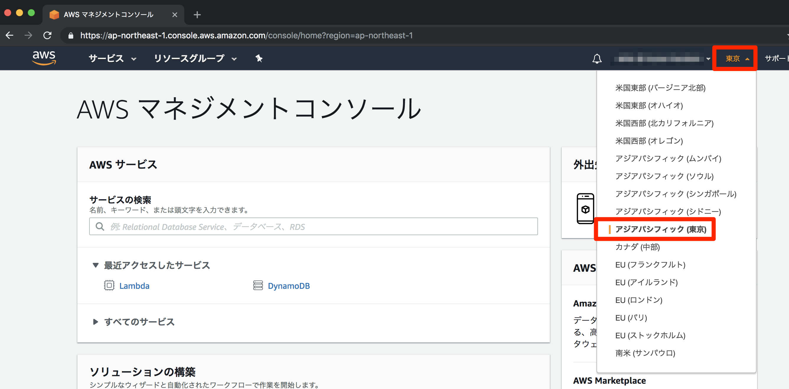
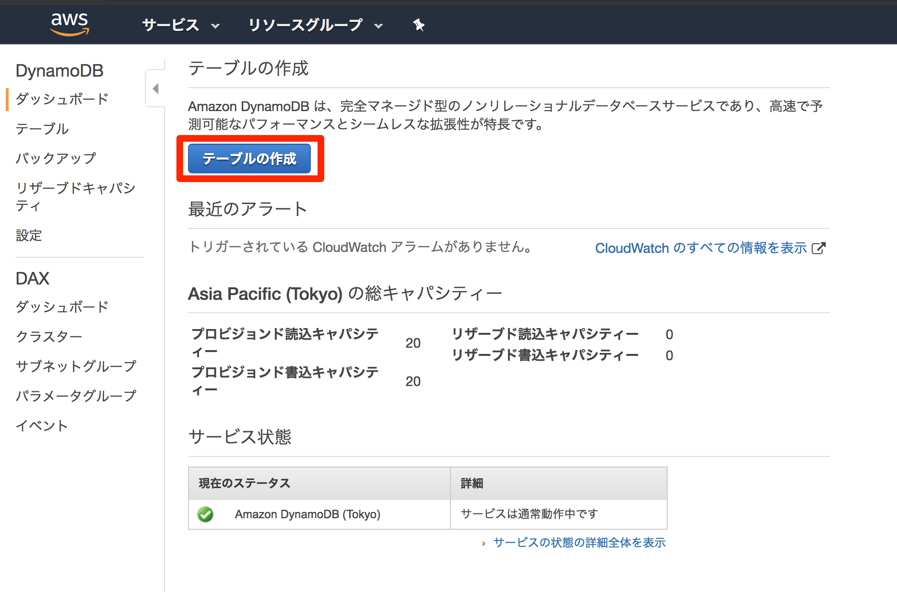
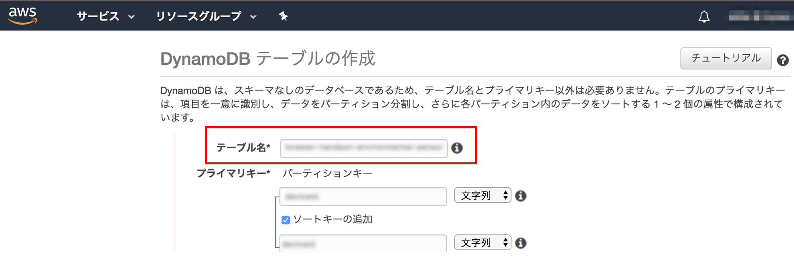
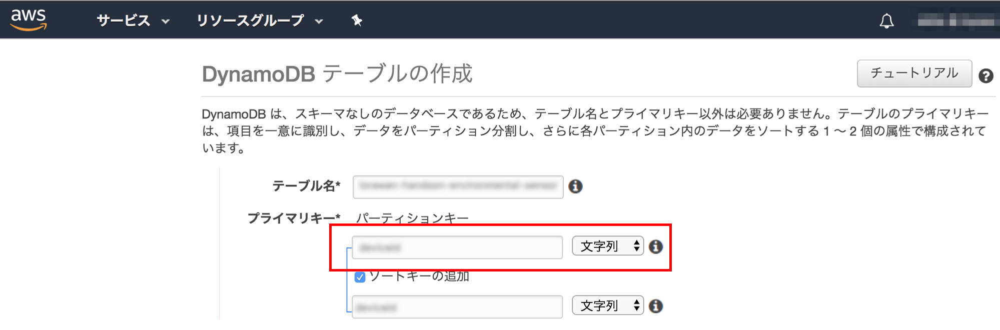
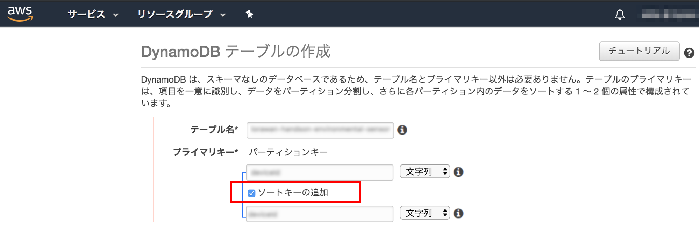
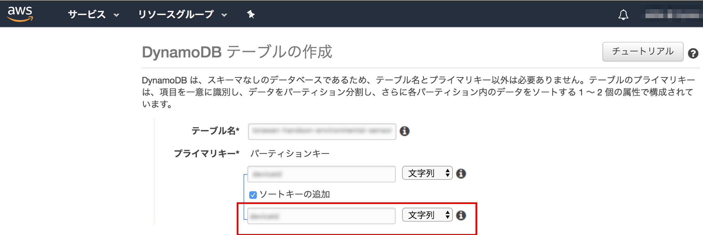
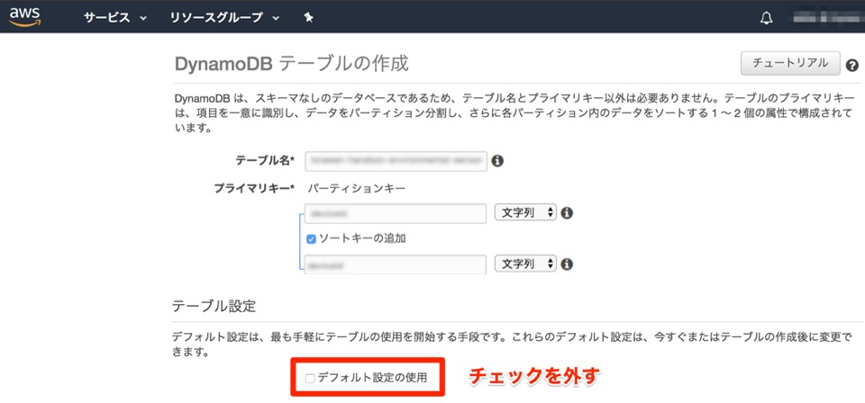

# IoT.kyoto VISの使い方

## 目次

### [[ステップ0] 事前準備](#step0)

### [[ステップ1] DynamoDB構築手順](#step1)

### [[ステップ2] IAM Access Keyを取得する](#step2)

### [[ステップ3] サインイン画面について](#step3)

### [[ステップ4] グラフ画面について](#step4)

## [ステップ0] 事前準備 <a name="step0"></a>

### 事前に準備するもの

- IoTデバイス(計測する値を出力します)
- AWSアカウント

### [0-1] IoT.kyoto VIS　構成例


### [0-2] IoT.kyoto VISを使用するために必要なデータ

(例)温度と照度を出力するIoTデバイスの場合に必要なデータ

- **IoTデバイスを識別するIDとタイムスタンプは必須です**
- 下表の場合、temperatureとlightはIoTデバイスから出力される計測対象の値です
- IoTデバイスで計測したこれらのデータは「[[ステップ1] DynamoDB構築](#step1)」でDynamoDBのテーブルを作成後、
  テーブルにデータを書き込みます。さらに「[[ステップ4] グラフ画面について](##[ステップ4]-グラフ画面について)」で設定することで、
  リアルタイムでグラフ化することができます。

| deviceID | time                | temperature | light |
| -------- | ------------------- | ----------- | ----- |
| 01       | 2016-03-04 10:17:44 | 25.6        | 103   |
| 02       | 2016-03-04 10:17:44 | 22.1        | 216   |
| 01       | 2016-03-04 10:17:45 | 25.8        | 98    |
| 02       | 2016-03-04 10:17:45 | 21.9        | 210   |

タイムスタンプは書き6種類の内いずれかをお使いください。画面表示辞にUTCはJSTに自動変換されます。

```txt
[JST]
　YYYY-MM-DD hh:mm:ss
　YYYY/MM/DD hh:mm:ss
　YYYY-MM-DDThh:mm:ss.sss+0900
[UTC]
　YYYY-MM-DDThh:mm:ssZ
　UNIXタイムスタンプ(整数10桁)
　UNIXタイムスタンプ(整数13桁)
```

### [0-3] DynamoDBにデータを書き込む方法

- デバイスID／タイムスタンプ／計測値を下記のようにJSON形式で書き出します。csvは利用できません。

```json
{"light": 164, "ID": "id000", "time_sensor": "2016-03-28 15:16:48"}
{"light": 692, "ID": "id000", "time_sensor": "2016-03-28 15:16:49"}
```

- 下記のような方法でJSONをDynamoDBに書き込みます。[実装例](https://iot.kyoto/integration_case/)も参照して下さい。
  - APIを利用する
  - 各種言語向けのSDKを利用する
  - [AWS CLI](https://aws.amazon.com/jp/cli/)を利用する
  - AWS IoTやLambdaなどのAWSのサービスを経由して書き込む
  - fluentdなどのミドルウェアを利用する
  - DataSpiderなどのETLツールを利用する(JSONでなくてもOK)
- API/SDKついては[AWSの開発者用リソース](https://aws.amazon.com/jp/dynamodb/developer-resources/)を参照して下さい

## [ステップ1]DynamoDB構築手順<a name="step1"></a>

### 1. AWSマネジメントコンソールにサインインします

- [AWSマネジメントコンソール](https://console.aws.amazon.com/)にログインします
- マネジメントコンソールの「サービスの検索」欄に、「dynamo」と入力し、「DynamoDB」をクリックする


### 2. リージョンを確認します

- 得に他のリージョンを選ぶ理由がない場合は[アジアパシフィック(東京)]を選択してください。



### 3. DynamoDB のコンソール画面で[デーブルの作成]を選択します



### 4. テーブル名に任意の名前をつけます



### 5. プライマリキーのパーティションキーに任意の名前をつけます

- データ型はIoTデバイスが出力する値に合わせて「文字列」または「数値」を選んでください
- IoTデバイスの特定に分かりやすい名前を付けてください



### 6. [ソートキーの追加]のチェックボックスを選択してチェックを入れます



### 7. プライマリキーのソートキーに任意の名前をつけてください

- 時間の特定に分かりやすい名前を付けてください
- データ型はIoTデバイスが出力する値に合わせて「文字列」または「数値」を選んでください



### 8. テーブル設定の[デフォルト設定の使用]のチェックボックスを選択してチェックを外します

<!-- メモ：この設定いらんくない？デフォルト5だし... -->



### 9. プロビジョニングされたキャパシティの[読み込み容量ユニット]と[書き込み容量ユニット]のチェックを外してユニット数を設定してください

<!-- メモ：この設定いらんくない？オートスケールさせない理由とは...？ -->
<!-- メモ：送信頻度にもよるし一概には言えないのでやっぱりこの設定(以下略) -->
- IoTデバイス2～3個までなら「読み込み容量ユニット」が5、「書き込み容量ユニット」が5で足ります
  - [作成]をクリックしてテーブル作成は完了です
