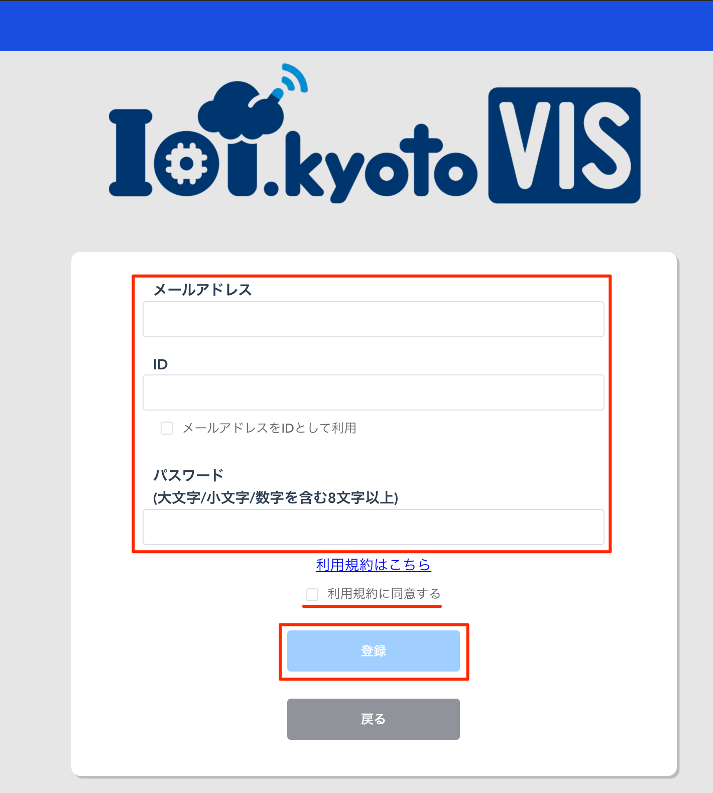

# IoT.kyoto VIS の使い方

## 目次

### [[ステップ 0] 事前準備](#step0)

### [[ステップ 1] DynamoDB 構築手順](#step1)

### [[ステップ 2] IAM Access Key を取得する](#step2)

### [[ステップ 3] IoT.kyoto VIS のアカウントを使ってログインする](#step3)

### [[ステップ 4] グラフ画面で可視化する](#step4)

### [[付録 1] グラフ設定を変更する](#option1)

### [[付録 2] 過去データを検索する](#option2)

### [[付録 3] アラートの設定をする](#option3)

### [[付録 4] グラフを並び替える](#option4)

### [[付録 5] グラフを削除する](#option5)

## [ステップ 0] 事前準備 <a name="step0"></a>

### 事前に準備するもの

-   IoT デバイス(計測する値を出力します)
-   AWS アカウント

### 1. IoT.kyoto VIS 　構成例

IoT.kyoto VIS を活用する際の構成例として以下があります

IoT.kyoto VIS ではデータが Amazon DynamoDB に存在していることが前提となります


### 2. IoT.kyoto VIS を使用するために必要なデータ

(例)温度と照度を出力する IoT デバイスの場合に必要なデータ

-   **IoT デバイスを識別する ID とタイムスタンプは必須です**
-   下表の場合、temperature と light は IoT デバイスから出力される計測対象の値です
-   IoT デバイスで計測したこれらのデータは「[[ステップ 1] DynamoDB 構築](#step1)」で DynamoDB のテーブルを作成後、
    テーブルにデータを書き込みます。さらに「[[ステップ 4] グラフ画面で可視化する](#step4)」で設定することで、
    リアルタイムでグラフ化することができます。

    | deviceID | time                 | temperature | light |
    | -------- | -------------------- | ----------- | ----- |
    | 01       | 2016-03-04T10:17:44Z | 25.6        | 103   |
    | 02       | 2016-03-04T10:17:44Z | 22.1        | 216   |
    | 01       | 2016-03-04T10:17:45Z | 25.8        | 98    |
    | 02       | 2016-03-04T10:17:45Z | 21.9        | 210   |

-   タイムスタンプは下記の内いずれかをお使いください。画面表示時に UTC は 設定されたタイムゾーン に自動変換されます。

    **TODO: 新しいものに変更する**

```txt
[UTC]
  YYYY-MM-DDThh:mm:ssZ
  UNIXタイムスタンプ(整数10桁)
  UNIXタイムスタンプ(整数13桁)
[それ以外]
  YYYY-MM-DD hh:mm:ss
  YYYY-MM-DD hh:mm:ss.sss
  YYYY-MM-DDThh:mm:ss+hhmm
  YYYY-MM-DDThh:mm:ss+hh:mm
  YYYY-MM-DDThh:mm:ss.sss+hhmm
  YYYY-MM-DDThh:mm:ss.sss+hh:mm
  YYYY/MM/DD hh:mm:ss
  YYYY/MM/DD hh:mm:ss.sss
  YYYY/MM/DDThh:mm:ss+hhmm
  YYYY/MM/DDThh:mm:ss+hh:mm
  YYYY/MM/DDThh:mm:ss.sss+hhmm
  YYYY/MM/DDThh:mm:ss.sss+hh:mm
```

### 3. DynamoDB にデータを書き込む方法

-   デバイス ID／タイムスタンプ／計測値を下記のように **JSON 形式**で書き出します
-   csv 等の場合は JSON 形式に変換する必要があります

```json
{"light": 164, "ID": "id000", "time_sensor": "2016-03-28 15:16:48"}
{"light": 692, "ID": "id000", "time_sensor": "2016-03-28 15:16:49"}
```

-   下記のような方法で データ を DynamoDB に書き込みます([実装例](https://iot.kyoto/integration_case/)も参考にしてください)
    -   API を利用する
    -   各種言語向けの SDK を利用する
    -   [AWS CLI](https://aws.amazon.com/jp/cli/)を利用する
    -   AWS IoT や Lambda などの AWS のサービスを経由して書き込む
    -   fluentd などのミドルウェアを利用する
    -   DataSpider などの ETL ツールを利用する(JSON でなくても OK)
-   API/SDK ついては[AWS の開発者用リソース](https://aws.amazon.com/jp/dynamodb/developer-resources/)を参照して下さい

## [ステップ 1]DynamoDB テーブルを構築する<a name="step1"></a>

### 1. AWS マネジメントコンソールにサインインします

-   [AWS マネジメントコンソール](https://console.aws.amazon.com/)にログインします
-   マネジメントコンソールの「サービスの検索」欄に、「dynamo」と入力し、「DynamoDB」を選択します


### 2. リージョンを確認します

-   得に他のリージョンを選ぶ理由がない場合は[アジアパシフィック(東京)]を選択してください。


### 3. DynamoDB のコンソール画面で[デーブルの作成]を選択します


### 4. テーブル名に任意の名前を入力します


### 5. プライマリキーのパーティションキーに任意の名前を入力します

-   IoT デバイスを識別する値が入るキーになります
-   IoT デバイスが送信するキー名に沿った名前を入力してください
-   データ型は IoT デバイスが出力する値に合わせて「文字列」または「数値」を選んでください


### 6. [ソートキーの追加]のチェックボックスにチェックを入れます


### 7. プライマリキーのソートキーに任意の名前を入力します

-   データの送信時刻など時刻が入ります
-   IoT デバイスが送信する送信時間のキー名に沿った名前を入力してください
-   データ型は IoT デバイスが出力する値に合わせて「文字列」または「数値」を選んでください


## [ステップ 2]IAM Access Key を取得する<a name="step2"></a>

ここで作成するアクセスキーにはすべての DynamoDB テーブルのレコードとテーブル情報を取得することができる権限を付与します。テーブルを絞りたい場合は[こちら](#create_custom_key)の手順を参考にしてください。

### 1. Identity and Access Management(IAM)コンソールを開いてください

-   マネジメントコンソールの「サービスの検索」欄に、「IAM」と入力し「IAM」を選択します


### 2. [ユーザー]を選択して開き、[ユーザーを追加]をクリックし、任意の名前でユーザーを作成します


-   [プログラムによるアクセス]のチェックボックスにチェックを入れます
-   [次のステップ]を選択します


### 3. アクセス権限の設定を行います

-   [既存のポリシーを直接アタッチ]を選択します
-   [AmazonDynamoDBReadOnlyAccess]ポリシーにチェックをいれて[次のステップ]を選択します


### 4. [タグの追加]は任意で入力し、[次のステップ]を選択します

### 5. 内容を確認し問題がなければ[ユーザーの作成]ボタンを選択してアカウントを作成します

-   アカウント作成後、認証情報が記載された csv ファイルをダウンロードします

    <span style="color: red;">※ここでダウンロードを忘れると再度認証情報の発行が必要になるので必ずダウンロードしてください</span>


## ※テーブルを絞った権限を付与した Access Key の作成方法<a name="create_custom_key"></a>

Access Key の発行が完了している場合は[ステップ 3](#step3)に進んでください

### 1. Identity and Access Management(IAM)コンソールを開いてください

-   マネジメントコンソールの「サービスの検索」欄に、「IAM」と入力し「IAM」を選択します


### 2. [ポリシー]を選択して開き、[ポリシーの作成]を選択します


### 3. 特定の DynamoDB テーブルの読み取り専用権限を付与したポリシーを作成します

-   [サービスを選択]から DynamoDB を選択します
    
-   [フィルタアクション]に`getItem`と入力し`GetItem`のチェックボックスにチェックを入れます
    
-   [フィルタアクション]に`query`と入力し`Query`のチェックボックスにチェックを入れます
    
-   [フィルタアクション]に`describeTable`と入力し`DescribeTable`のチェックボックスにチェックを入れます
    
-   [リソース]を選択し[ARN の追加]ボタンを選択します
    
-   必要情報を記入後[追加]ボタンを選択します
    
-   入力内容を確認し[ポリシーの確認]を選択します
    
-   任意のポリシー名を入力して[ポリシーの作成]を選択します
    

### 4. [ユーザー]を選択して開き[ユーザーを追加]を選択し、任意の名前でユーザーを作成します


-   [プログラムによるアクセス]のチェックボックスにチェックを入れます
-   [次のステップ]をクリックします


### 5. アクセス権限の設定を行います

-   [既存のポリシーを直接アタッチ]を選択します
-   3 で作製したポリシーのチェックボックスにチェックを入れて[次のステップ]を選択します
-   先程のポリシーをアタッチすることで特定の DynamoDB からデータを取得することが許可されます


### 6. [タグの追加]は任意で入力し、[次のステップ]を選択します

### 7. 内容を確認し問題がなければ[ユーザーの作成]ボタンを選択してアカウントを作成します

-   アカウント作成後、認証情報が記載された csv ファイルをダウンロードします

    <span style="color: red;">※ここでダウンロードを忘れると再度認証情報の発行が必要になるので必ずダウンロードしてください</span>


## [ステップ 3] IoT.kyoto VIS のアカウントを使ってログインする<a name="step3"></a>

### 0. [IoT.kyoto VIS](https://vis2.iot.kyoto){:target="\_blank"}を開きます


1. サインイン：新規登録を終えたあとはここからサインインしてください
   (旧 VIS サイトで登録されたログイン情報もこちらで利用することができます)

2. 新規登録：アカウントを保有していない場合はこちらからアカウント作成をしてください
3. パスワードを忘れた方はこちら：アカウントのパスワードを忘れた場合はこちらからパスワードの再発行を実施してください

### 1. アカウントの作成をします

#### 1.1. 「新規登録」ボタンを選択すると新規登録画面が表示されます



#### 1.2. メールアドレスと ID、パスワードをそれぞれ入力します

ID がメールアドレスと同様で問題なければ「メールアドレスと同じものを ID として利用する」のチェックボックスにチェックを入れます

利用規約を確認、同意にチェックを入れた後、「登録」ボタンを選択すると設定したメールアドレスに確認メールが届きます。

<span style="color: red;">※パスワードを設定する際は大文字、小文字、数字をそれぞれ含め 8 文字以上に設定してください。この条件を満たさない場合はエラーになります。</span>

#### 1.3. 設定したメールアドレスに認証メールが届くのを待ちます

メール内のリンクをクリックすると登録完了です

### 2. パスワードを忘れてしまった場合

#### 2.1. 「パスワードを忘れた方はこちら」を選択します


#### 2.2. ID を入力して「パスワードをリセットする」ボタンを選択します

登録したメールアドレスに認証コードが送信されます

<span style="color: red;">※ID を忘れた場合はパスワードの再設定はできませんのでご注意ください</span>

#### 2.3 メールに記載された認証コードを使ってパスワードのリセットをします

送信された認証コードをフォームに入力し、新しいパスワードを設定します

「パスワードを設定する」ボタンを選択するとパスワードの再設定完了です


## [ステップ 4] グラフ画面で可視化する<a name="step4"></a>


1. ユーザー設定：タイムゾーンや言語の設定ができます
2. web サイト：[IoT.kyoto](https://iot.kyoto){:target="\_blank"}のページに遷移します
3. マニュアル：本ページに遷移します
4. ログアウト：ログアウトします
5. グラフ追加：グラフを追加します
6. グラフ並べ替え：グラフが複数ある場合、グラフの並び替えをします
7. グラフ表示方法切り替え：グラフを 2 列に並べたり、1 列に並べたりできます

### 1. グラフを追加します

#### 1.1. 「グラフ追加」アイコンを選択します

**ここから先は新しい設定フローに則って新しくマニュアルを作成します**

## [付録 1] グラフ設定を変更する<a name="option1"></a>

## [付録 2] 過去データを検索する<a name="option2"></a>

## [付録 3] アラートの設定をする<a name="option3"></a>

## [付録 4] グラフを並び替える<a name="option4"></a>

## [付録 5] グラフを削除する<a name="option5"></a>
