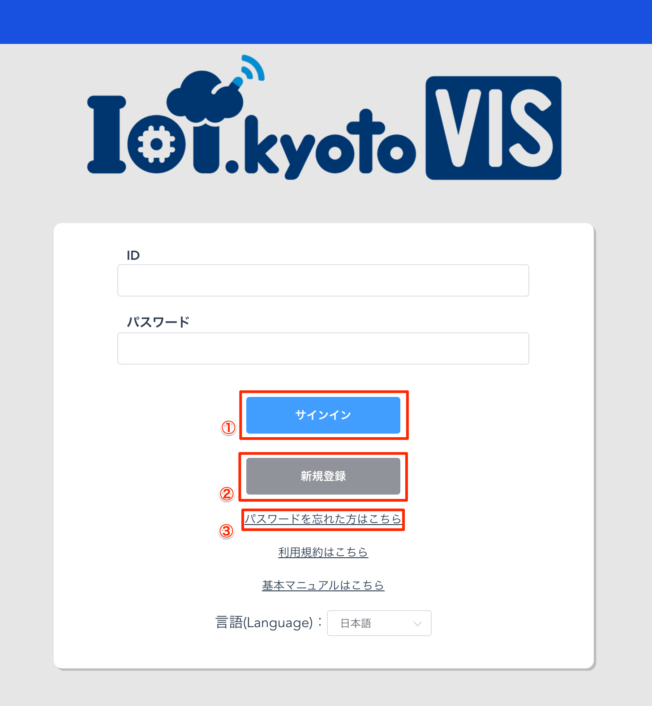
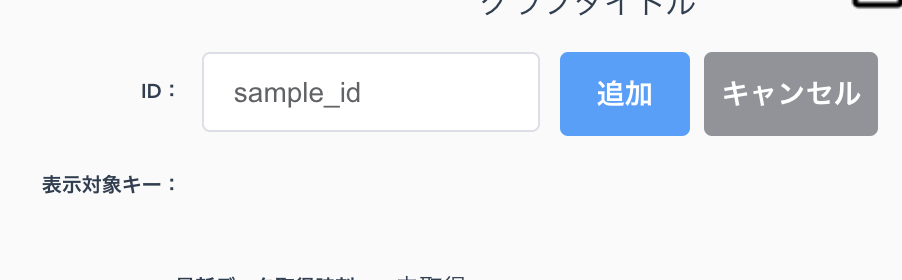
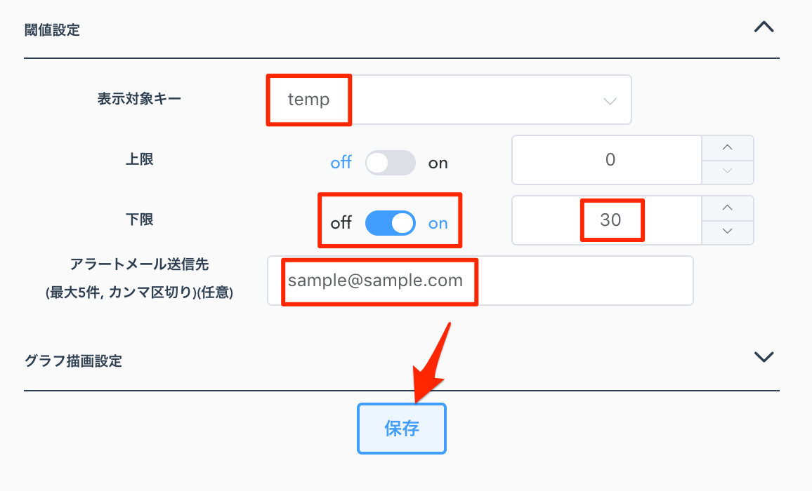

## 目次

### [[ステップ 0] 事前準備](#step0)

### [[ステップ 1] DynamoDB テーブルを構築する](#step1)

### [[ステップ 2] IAM Access Key を取得する](#step2)

### [[ステップ 3] IoT.kyoto VIS のアカウントを使ってログインする](#step3)

### [[ステップ 4] グラフ画面で可視化する](#step4)

### [[付録 1] グラフ設定を変更する](#option1)

### [[付録 2] しきい値の設定をする](#option2)

### [[付録 3] 過去データを検索する](#option3)

### [[付録 4] csv をダウンロードする](#option4)

### [[付録 5] グラフを並び替える](#option5)

### [[付録 6] グラフを削除する](#option6)

## [ステップ 0] 事前準備 <a name="step0"></a>

### 事前に準備するもの

-   IoT デバイス(計測する値を出力します)
-   AWS アカウント

### 1. IoT.kyoto VIS 　構成例

IoT.kyoto VIS を活用する際の構成例として以下があります

IoT.kyoto VIS ではデータが Amazon DynamoDB に存在していることが前提となります


### 2. IoT.kyoto VIS を使用するために必要なデータ

(例)温度と照度を出力する IoT デバイスの場合に必要なデータ

-   **IoT デバイスを識別する ID とタイムスタンプは必須です**
-   下表の場合、temperature と light は IoT デバイスから出力される計測対象の値です
-   IoT デバイスで計測したこれらのデータは「[[ステップ 1] DynamoDB 構築](#step1)」で DynamoDB のテーブルを作成後、
    テーブルにデータを書き込みます。さらに「[[ステップ 4] グラフ画面で可視化する](#step4)」で設定することで、
    リアルタイムでグラフ化することができます。

    | deviceID | time                 | temperature | light |
    | -------- | -------------------- | ----------- | ----- |
    | 01       | 2016-03-04T10:17:44Z | 25.6        | 103   |
    | 02       | 2016-03-04T10:17:44Z | 22.1        | 216   |
    | 01       | 2016-03-04T10:17:45Z | 25.8        | 98    |
    | 02       | 2016-03-04T10:17:45Z | 21.9        | 210   |

-   タイムスタンプは下記の内いずれかをお使いください。画面表示時に UTC は 設定されたタイムゾーン に自動変換されます。

```txt
[UTC]
  YYYY-MM-DDThh:mm:ssZ
  UNIXタイムスタンプ(整数10桁)
  UNIXタイムスタンプ(整数13桁)
[それ以外]
  YYYY-MM-DD hh:mm:ss
  YYYY-MM-DD hh:mm:ss.sss
  YYYY-MM-DDThh:mm:ss+hhmm
  YYYY-MM-DDThh:mm:ss+hh:mm
  YYYY-MM-DDThh:mm:ss.sss+hhmm
  YYYY-MM-DDThh:mm:ss.sss+hh:mm
  YYYY/MM/DD hh:mm:ss
  YYYY/MM/DD hh:mm:ss.sss
  YYYY/MM/DDThh:mm:ss+hhmm
  YYYY/MM/DDThh:mm:ss+hh:mm
  YYYY/MM/DDThh:mm:ss.sss+hhmm
  YYYY/MM/DDThh:mm:ss.sss+hh:mm
```

### 3. DynamoDB にデータを書き込む方法

-   デバイス ID／タイムスタンプ／計測値を下記のように **JSON 形式**で書き出します
-   csv 等の場合は JSON 形式に変換する必要があります

```json
{"light": 164, "ID": "id000", "time_sensor": "2016-03-28 15:16:48"}
{"light": 692, "ID": "id000", "time_sensor": "2016-03-28 15:16:49"}
```

-   下記のような方法で データ を DynamoDB に書き込みます([実装例](https://iot.kyoto/integration_case/)も参考にしてください)
    -   API を利用する
    -   各種言語向けの SDK を利用する
    -   [AWS CLI](https://aws.amazon.com/jp/cli/)を利用する
    -   AWS IoT や Lambda などの AWS のサービスを経由して書き込む
    -   fluentd などのミドルウェアを利用する
    -   DataSpider などの ETL ツールを利用する(JSON でなくても OK)
-   API/SDK  については[AWS の開発者用リソース](https://aws.amazon.com/jp/dynamodb/developer-resources/)を参照して下さい

## [ステップ 1]DynamoDB テーブルを構築する<a name="step1"></a>

### 1. AWS マネジメントコンソールにサインインします

-   [AWS マネジメントコンソール](https://console.aws.amazon.com/)にログインします
-   マネジメントコンソールの「サービスの検索」欄に、「dynamo」と入力し、「DynamoDB」を選択します


### 2. リージョンを確認します

-   特に他のリージョンを選ぶ理由がない場合は[アジアパシフィック(東京)]を選択してください。


### 3. DynamoDB のコンソール画面で[テーブルの作成]を選択します


### 4. テーブル名に任意の名前を入力します


### 5. プライマリキーのパーティションキーに任意の名前を入力します

-   IoT デバイスを識別する値が入るキーになります
-   IoT デバイスが送信するキー名に沿った名前を入力してください
-   データ型は IoT デバイスが出力する値に合わせて「文字列」または「数値」を選んでください


### 6. [ソートキーの追加]のチェックボックスにチェックを入れます


### 7. プライマリキーのソートキーに任意の名前を入力します

-   データの送信時刻など時刻が入ります
-   IoT デバイスが送信する送信時間のキー名に沿った名前を入力してください
-   データ型は IoT デバイスが出力する値に合わせて「文字列」または「数値」を選んでください


### 8. テーブル設定の[デフォルト設定の使用]のチェックボックスが付いていることを確認して「作成」をクリックします

-   [デフォルト設定の使用]にチェックが付いていることを確認する
    -   セカンダリインデックスなし
    -   Auto Scaling のキャパシティーを AnyScale のデフォルト機能を示すテーブルの作成ページで 70% のターゲット使用率 (最低キャパシティーは 5 つの読み込みと 5 つの書き込み) に設定
    -   デフォルトの暗号化タイプによる保管時の暗号化
-   [作成]をクリックしてテーブル作成は完了です


## [ステップ 2]IAM Access Key を取得する<a name="step2"></a>

ここで作成するアクセスキーにはすべての DynamoDB テーブルのレコードとテーブル情報を取得することができる権限を付与します。テーブルを絞りたい場合は[こちら](#create_custom_key)の手順を参考にしてください。

### 1. Identity and Access Management(IAM)コンソールを開いてください

-   マネジメントコンソールの「サービスの検索」欄に、「IAM」と入力し「IAM」を選択します


### 2. [ユーザー]を選択して開き、[ユーザーを追加]をクリックし、任意の名前でユーザーを作成します


-   [プログラムによるアクセス]のチェックボックスにチェックを入れます
-   [次のステップ]を選択します


### 3. アクセス権限の設定を行います

-   [既存のポリシーを直接アタッチ]を選択します
-   [AmazonDynamoDBReadOnlyAccess]ポリシーにチェックをいれて[次のステップ]を選択します


### 4. [タグの追加]は任意で入力し、[次のステップ]を選択します

### 5. 内容を確認し問題がなければ[ユーザーの作成]ボタンを選択してアカウントを作成します

-   アカウント作成後、認証情報が記載された csv ファイルをダウンロードします

    <span style="color: red;">※ここでダウンロードを忘れると再度認証情報の発行が必要になるので必ずダウンロードしてください</span>


## ※テーブルを絞った権限を付与した Access Key の作成方法<a name="create_custom_key"></a>

Access Key の発行が完了している場合は[ステップ 3](#step3)に進んでください

### 1. Identity and Access Management(IAM)コンソールを開いてください

-   マネジメントコンソールの「サービスの検索」欄に、「IAM」と入力し「IAM」を選択します


### 2. [ポリシー]を選択して開き、[ポリシーの作成]を選択します


### 3. 特定の DynamoDB テーブルの読み取り専用権限を付与したポリシーを作成します

-   [サービスを選択]から DynamoDB を選択します
    
-   [フィルタアクション]に`getItem`と入力し`GetItem`のチェックボックスにチェックを入れます
    
-   [フィルタアクション]に`query`と入力し`Query`のチェックボックスにチェックを入れます
    
-   [フィルタアクション]に`describeTable`と入力し`DescribeTable`のチェックボックスにチェックを入れます
    
-   [リソース]を選択し[ARN の追加]ボタンを選択します
    
-   必要情報を記入後[追加]ボタンを選択します
    
-   入力内容を確認し[ポリシーの確認]を選択します
    
-   任意のポリシー名を入力して[ポリシーの作成]を選択します
    

### 4. [ユーザー]を選択して開き[ユーザーを追加]を選択し、任意の名前でユーザーを作成します


-   [プログラムによるアクセス]のチェックボックスにチェックを入れます
-   [次のステップ]をクリックします


### 5. アクセス権限の設定を行います

-   [既存のポリシーを直接アタッチ]を選択します
-   3 で作成したポリシーのチェックボックスにチェックを入れて[次のステップ]を選択します
-   先程のポリシーをアタッチすることで特定の DynamoDB からデータを取得することが許可されます


### 6. [タグの追加]は任意で入力し、[次のステップ]を選択します

### 7. 内容を確認し問題がなければ[ユーザーの作成]ボタンを選択してアカウントを作成します

-   アカウント作成後、認証情報が記載された csv ファイルをダウンロードします

    <span style="color: red;">※ここでダウンロードを忘れると再度認証情報の発行が必要になるので必ずダウンロードしてください</span>


## [ステップ 3] IoT.kyoto VIS のアカウントを使ってログインする<a name="step3"></a>

<span style="color: red;">
※IoT.kyoto VISはInternet Explorerには対応していませんのでご注意ください。

<span style="color: red;">
Google chrome や firefox 等のモダンブラウザをご利用ください。

### 0. [IoT.kyoto VIS](https://vis2.iot.kyoto){:target="\_blank"}を開きます



1. サインイン：新規登録を終えたあとはここからサインインしてください
   (旧 VIS サイトで登録されたログイン情報もこちらで利用することができます)

2. 新規登録：アカウントを保有していない場合はこちらからアカウント作成をしてください
3. パスワードを忘れた方はこちら：アカウントのパスワードを忘れた場合はこちらからパスワードの再発行を実施してください

### 1. アカウントの作成をします

#### 1.1. [新規登録]ボタンを選択すると新規登録画面が表示されます


#### 1.2. メールアドレスと ID、パスワードをそれぞれ入力します

ID がメールアドレスと同様で問題なければ「メールアドレスと同じものを ID として利用する」のチェックボックスにチェックを入れます

利用規約を確認し、[利用規約に同意する]にチェックを入れた後、[登録]ボタンを選択すると設定したメールアドレスに確認メールが届きます。

<span style="color: red;">※パスワードを設定する際は大文字、小文字、数字をそれぞれ含め 8 文字以上に設定してください。この条件を満たさない場合はエラーになります。</span>

#### 1.3. 設定したメールアドレスに認証メールが届くのを待ちます

メール内のリンクをクリックすると登録完了です

### 2. パスワードを忘れてしまった場合

#### 2.1. [パスワードを忘れた方はこちら]を選択します

#### 2.2. ID を入力して[パスワードをリセットする]ボタンを選択します


登録したメールアドレスに認証コードが送信されます

<span style="color: red;">※ID を忘れた場合はパスワードの再設定はできませんのでご注意ください</span>

#### 2.3 メールに記載された認証コードを使ってパスワードのリセットをします

送信された認証コードをフォームに入力し、新しいパスワードを設定します

[パスワードを設定する]ボタンを選択するとパスワードの再設定完了です


## [ステップ 4] グラフ画面で可視化する<a name="step4"></a>


1. ユーザー設定：タイムゾーンや言語の設定ができます
2. web サイト：[IoT.kyoto](https://iot.kyoto){:target="\_blank"}のページに遷移します
3. マニュアル：本ページに遷移します
4. ログアウト：ログアウトします
5. グラフ追加：グラフを追加します
6. グラフ並べ替え：グラフが複数ある場合、グラフの並び替えをします
7. グラフ表示方法切り替え：グラフを 2 列に並べたり、1 列に並べたりできます

### 1. グラフを追加します

-   [グラフ追加]アイコンを選択します


### 2. 認証情報の設定をします

-   [[ステップ 2] IAM Access Key を取得する](#step2)で作成したアクセスキーとシークレットキーを入力します
-   認証情報ストア名は任意の名前を入れてください

    <span style="color: red;">※すでに登録されている名前を指定すると上書きされるので注意してください</span>

-   リージョンは DynamoDB テーブルが作成されているリージョンを選択して[次へ]を選択します


-   すでに登録している認証情報を使用する場合は[既存認証情報]を選択します
-   使用する認証情報を選択して[次へ]を選択します


### 3. テーブル名を入力します

-   グラフを可視化するテーブル名を入力します
-   [接続確認]を選択します
-   パーティションキーとソートキーの情報に誤りがなければ[次へ]を選択します

<span style="color: red;">※この時「テーブル名を確認してください」と表示される場合入力されたテーブルが存在していません。テーブル名が正しく入力されているか確認してください</span>

<span style="color: red;">※この時「Step1 で設定した認証情報を確認してください」と表示される場合、認証情報が正しく入力されていない、または設定した認証情報に必要な権限が付与されていない可能性があります。それぞれ確認してください。付与する権限は[[ステップ 2] IAM Access Key を取得する](#step2)を確認してください</span>

|||

### 4. センサーデータの日時フォーマットを設定します

-   [UNIX 形式]または[それ以外]の該当するものを選択します
-   [UNIX 形式]の場合はミリ秒まで含まれる 13 桁、またはミリ秒を含まない 10 桁のどちらかを選択して[次へ]を選択します
-   [それ以外]の場合はセンサーから送信される日時のフォーマットに合わせてそれぞれ選択して[完了]を選択します
-   日時内にタイムゾーンが指定されていない場合は(b)を「なし」とし、[ローカル時刻のタイムゾーン]にセンサーデータの日時のタイムゾーンを選択してください
-   フォーマットに間違いがないことを確認して[次へ]を選択します


### 5. 設定内容を確認して保存します

-   設定内容に誤りがないことを確認して[保存]を選択します


### 6. 表示したいセンサーを選択します

-   グラフ画面に戻ったら画像のセレクタから表示したいセンサーを選択します


#### 表示したいセンサーが無いとき

-   セレクタの[追加する]を選択します
-   表示されるフォーム内に表示したいパーティションキーの値となるものを入力し[追加]を選択します
-   [キャンセル]を選択しセレクタに戻り、追加したキーを選択します



### 7. 表示したい表示対象キーを選択し、グラフを描画します

-   キーの更新ボタンを選択します
-   表示対象キー横に表示される選択肢から表示したいグラフの項目を選択することでグラフが描画されます

※最新データが存在しない場合描画はできません


## [付録 1] グラフ設定を変更する<a name="option1"></a>

ここではグラフのタイトルや更新頻度を設定する方法を紹介します

### 1. グラフの設定画面を開きます

-   設定を変更したいグラフ画面の[歯車アイコン]を選択します


-   設定画面から[マニュアル設定]を選択します


-   [グラフの描画設定]タブを選択します


### 2. 各種設定をします


1. グラフ上部に表示するタイトルを変更できます
2. グラフデータを更新する間隔を設定できます

    最小値は 1 秒ですが値を小さくするとグラフ描画幅が狭くなります

3. グラフに描画するデータの長さを指定できます

    現時刻から指定された分だけデータを取得します

4. グラフの横軸に表示する日時フォーマットを設定できます
5. 縦軸のレンジを設定できます

    off の場合自動で設定されます

6. グラフのデータ間の線のつなぎ方を設定できます
7. 選択できるパーティションキーの追加・削除ができます
8. 選択できる表示対象キーの追加・削除ができます

## [付録 2] しきい値の設定をする<a name="option2"></a>

### 1. しきい値設定画面を開きます

-   しきい値を設定したいグラフ画面の[歯車アイコン]を選択します


-   設定画面から[マニュアル設定]を選択します


-   [閾値設定]タブを開きます


### 2. 設定したい項目にしきい値を設定します

-   表示対象キーからしきい値を設定したい項目を選択します
-   設定したい項目(上限/下限)のスイッチを切り替え、数値を設定します
-   アラートメールを送信する場合は[アラートメール送信先]にメールアドレスを入力してください
    複数指定する場合はカンマで区切ってください(最大 5 件まで登録できます)
-   設定項目の入力が完了したら[保存]ボタンを選択します



### 異常履歴の確認ができます

-   設定したしきい値を上回る/下回ると異常履歴に通知が来ます


-   [異常履歴]ボタンを選択すると設定したしきい値を上回った/下回った履歴を確認することができます(最大 100 件)


### メール設定をすることでメール通知を受け取ることができます

-   しきい値設定にてアラートメール送信先を指定するとしきい値を上回った/下回ったときにメール通知を受け取ることができます

    <span style="color: red;">※IoT.kyoto VIS 画面を開いている間のみメールを受け取ることができます</span>


## [付録 3] 過去データを検索する<a name="option3"></a>

### 1. 過去データ検索画面を開きます

-   過去データを検索したいグラフ画面の[虫眼鏡アイコン]を選択します


### 2. 検索事項を記入します

-   検索したいデバイスや表示対象キーの選択をします
-   検索したい日時の指定をします
    -   日時指定では指定した日時「以前」「以後」と「期間指定」の選択が可能です
-   検索結果のグラフの縦軸レンジを設定したい場合はレンジ設定を「on」にして数値を設定します


### 3. グラフを取得します

-   [検索]ボタンを選択することでデータを取得しグラフを表示することができます


<span style="color: red;">※参照している DynamoDB テーブルの読み込みキャパシティ状況によってデータ取得に失敗することがあります</span>

<span style="color: red;">その際は検索対象期間を狭くしたり DynamoDB テーブルの読み込みキャパシティの調整を実施してください</span>

## [付録 4] csv をダウンロードする<a name="option4"></a>

### 1. csv ダウンロード画面を開きます

-   csv のダウンロードをしたいグラフ画面の[ダウンロードアイコン]を選択します


### 2. ダウンロードしたいデバイスと対象期間を指定します

-   ダウンロードしたいデバイスをセレクタから選択します
-   ダウンロード対象期間を設定します
    -   対象期間の設定では指定した日時「以前」「以後」と「期間指定」の選択が可能です


### 3. csv ファイルを取得します

-   [ダウンロード]ボタンを選択することで指定された条件のデータの csv ファイルを取得することができます


<span style="color: red;">※取得対象データが 100,000 件あるいは 5MB を超える場合はダウンロードできません</span>

<span style="color: red;">その場合は対象期間を調整してください</span>

<span style="color: red;">※取得対象データが 100,000 件、5MB に収まっていても対象の DynamoDB テーブルの読み込みキャパシティの状況によってデータの取得に失敗することがあります</span>

<span style="color: red;">その場合は対象期間を調整したり DynamoDB テーブルの読み込みキャパシティを調整してください</span>

## [付録 5] グラフを並び替える<a name="option5"></a>

この機能は複数のグラフ画面がある時のみ使用可能です

### 1. グラフ並び替えモードに切り替えます

-   画面右上にある[並べ替えモード切り替え]ボタンを選択します


### 2. グラフの並べ替えを実施します

-   グラフ画面に[ここをドラッグしてグラフを並び替える]と表示されているエリアとドラッグすると該当のグラフ画面の移動をすることができます


### 3. 並べ替えモードを終了します

-   グラフの並べ替えが完了したら各グラフ画面にある[並べ替えモードを終了する]ボタン、または 1 で選択した[並べ替えモード切り替え]ボタンを選択します


## [付録 6] グラフを削除する<a name="option6"></a>

### 1. [グラフ削除]ボタンを選択します

-   削除したい対象のグラフ画面にある[ゴミ箱アイコン]を選択します


### 2. アラート画面からグラフの削除を実行します

-   1 のボタンを選択するとグラフ削除の確認画面が表示されます
    削除しても問題ない場合は[OK]ボタンを選択します


<span style="color: red;">※[OK]ボタンの選択後はグラフの設定内容等も削除されますのでご注意ください</span>
